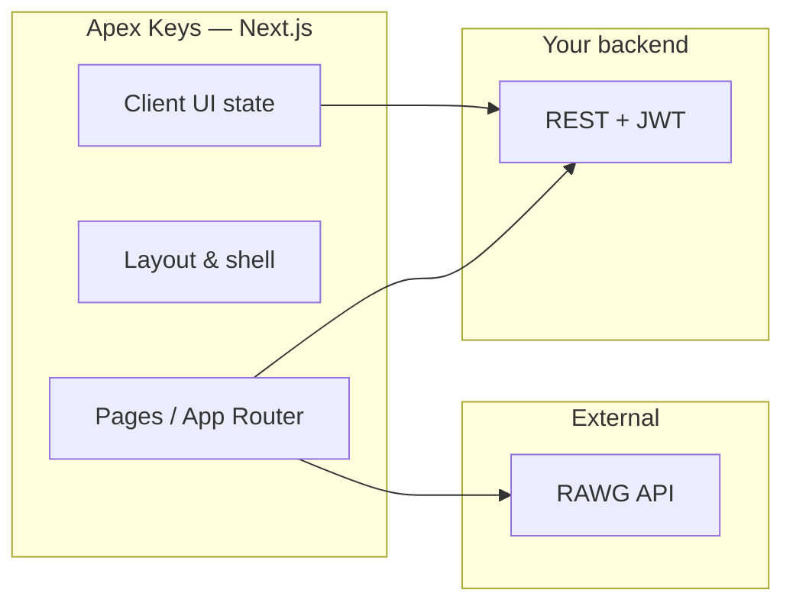

<div align="center">


**Premium raffle platform for Steam keys and digital games**

*Client application — production-grade UI, API-ready architecture*

<p>
  <a href="https://nextjs.org/"></a>
  <a href="https://www.typescriptlang.org/"></a>
  <a href="https://tailwindcss.com/"></a>
  <a href="https://react.dev/"></a>
</p>

</div>

---

## Contents

| | |
|:---|:---|
| [Positioning](#positioning) | Product scope and what this repository delivers |
| [Capabilities](#capabilities) | Surfaces, flows, and operator tools |
| [Architecture](#architecture) | How the client fits in the stack |
| [Tech stack](#tech-stack) | Frameworks, libraries, and conventions |
| [Repository structure](#repository-structure) | Source layout at a glance |
| [Getting started](#getting-started) | Install, run, and quality gates |
| [Configuration](#configuration) | Environment variables and external services |
| [API integration](#api-integration) | Backend contract and CORS |
| [Experience standards](#experience-standards) | Design system and UX principles |
| [Documentation](#documentation) | Internal references |
| [License](#license) | Usage terms |

---

## Positioning

**Apex Keys** is the **customer- and operator-facing web client** for a high-trust raffle experience: clear progress, deliberate calls to action, and a **dark, tactical, premium** visual language that reinforces legitimacy without visual clutter.

| Dimension | Detail |
|-----------|--------|
| **Role** | Presentation layer — consumes a REST API for auth, raffles, wallet, and purchases |
| **Maturity** | UI and interaction patterns implemented; **live API wiring** is the next integration phase |
| **Audience** | End users (browse, buy numbers, wallet) and platform owners (admin back office) |

---

## Capabilities

<details>
<summary><strong>Customer journey</strong> — marketing, arena, wallet, account</summary>

| Surface | Capability |
|---------|------------|
| **Home** | Featured raffle hero, active raffles grid, progress and pricing at a glance |
| **Raffle** | Dynamic route `raffle/[id]`, selectable number grid, checkout summary, sold-state handling |
| **Wallet** | Slide-over drawer: balance, Pix deposit scaffolding (mock), recent activity list |
| **Auth** | Modal with login / registration (form-ready; token persistence to align with API) |

</details>

<details>
<summary><strong>Operations (Admin)</strong> — command center</summary>

| Surface | Capability |
|---------|------------|
| **Admin** | Route `admin` — create raffle operations, monitor listed raffles, action placeholders (draw winner, cancel & refund) |
| **Catalog assist** | Debounced game search via **RAWG** (or **mock catalog** when no API key) with cover preview and auto-filled metadata fields |

</details>

---

## Architecture

The frontend is a **decoupled SPA-style application** on Next.js: static and dynamic routes, client components where interactivity is required, and a clear boundary to the backend.



---

## Tech stack

| Layer | Choice | Rationale |
|-------|--------|-----------|
| **Runtime** | Node.js 20+ | Aligns with current Next.js LTS expectations |
| **Framework** | Next.js 16 (App Router) | File-based routing, optimized builds, modern React |
| **UI** | React 19 | Concurrent-ready component model |
| **Types** | TypeScript 5 | Contract clarity across modules |
| **Styling** | Tailwind CSS v4 | Design tokens as utilities; `@config` + shared palette |
| **Icons** | Lucide React | Consistent stroke icons, tree-shakeable |
| **Media** | `next/image` | Optimized delivery where remote patterns are configured |

**Brand tokens (Tailwind `theme.extend`):** `apex-bg`, `apex-surface`, `apex-primary`, `apex-accent`, `apex-text`, `apex-success` — single source of truth for marketing, product, and admin surfaces.

---

## Repository structure

```
src/
├── app/                    # Routes: /, /raffle/[id], /admin; metadata & global styles
├── components/
│   ├── layout/             # Header, WalletDrawer, AuthModal
│   └── ui/                 # Shared primitives (reserved / incremental)
├── hooks/                  # Reusable React hooks
├── lib/                    # Utilities
└── types/                  # Shared TypeScript types
public/
├── logos/                  # Wordmark & brand PNGs (static)
images/                     # README & marketing assets (not necessarily served by app)
```

---

## Getting started

```bash
npm install
npm run dev
```

Application URL: **[http://localhost:3000](http://localhost:3000)**.

| Script | Use |
|--------|-----|
| `npm run dev` | Local development with hot reload |
| `npm run build` | Production compilation |
| `npm run start` | Serve the production build |
| `npm run lint` | ESLint (Next.js config) |

---

## Configuration

Create **`.env.local`** in the project root (never commit secrets):

| Variable | Required | Purpose |
|----------|----------|---------|
| `NEXT_PUBLIC_RAWG_API_KEY` | No | Enables live **RAWG** search in **Admin**. Omitted or placeholder → **mock** game list for UI development |

> **Production guidance:** Any `NEXT_PUBLIC_*` variable is **visible in the browser**. For RAWG or other third-party keys in production, prefer a **server route or BFF** that proxies authenticated requests.

**Favicon / app icon:** `src/app/icon.png` (mascot mark, transparent background), per Next.js [metadata file conventions](https://nextjs.org/docs/app/api-reference/file-conventions/metadata/app-icons).

---

## API integration

| Topic | Guidance |
|-------|----------|
| **Contract** | REST, JSON, JWT bearer auth on protected routes |
| **Base URL** | Example local: `http://127.0.0.1:8000` — configure per environment |
| **CORS** | Backend must allow the frontend origin (e.g. `http://localhost:3000` in development) |
| **Reference** | See [`FRONTEND_API.md`](./FRONTEND_API.md) for endpoints, payloads, and error shapes |

---

## Experience standards

| Pillar | Implementation |
|--------|----------------|
| **Visual discipline** | Edge-lighting and inset highlights over large glows; typography tuned for contrast without harsh brilliance |
| **Conversion clarity** | Primary actions (buy, pay, participate) use accent color and hierarchy consistent across pages |
| **Accessibility** | Semantic structure, labels on forms, keyboard-dismissible overlays where applicable |
| **Responsiveness** | Mobile-first navigation (wallet, auth, menus); grids adapt from single column to multi-column |

---

## Documentation

| Document | Description |
|----------|-------------|
| [`FRONTEND_API.md`](./FRONTEND_API.md) | Endpoint reference, models, and suggested UI flows for backend integration |

---

## License

**Proprietary.** All rights reserved unless the repository owner explicitly grants otherwise.

---

<div align="center">

**Apex Keys** · *Precision interface. Trust at first load.*

<br />

<sub>Engineering note: this README reflects the repository state at the time of last update; align deployment and secrets with your organization’s policy.</sub>

</div>
